# Churn Analysis Report

This repository contains a detailed analysis of customer churn, providing insights into churn rates, reasons, demographics, contracts, payment methods, and geographic trends. It was created in Power Bi desktop and is available online via Power BI service here = **(https://app.powerbi.com/view?r=eyJrIjoiMTgwZTI5MTItNjkxZS00NTcxLTk2MWQtZjBhMmQ1ODM5ZGNlIiwidCI6IjNlYTdjMTI4LWM2MDEtNDQ3OS1hMDAzLWUxNGQwMGMwYjVjYiJ9)**

## Key Overall Metrics

- **Total Churn Rate:** 26.86% of customers
- **Total Customers:** 6,687
- **Customers Churned:** 1,796

## Visualizations Breakdown

### 1. Churn Rate Overview

**Visual:** Card showing overall churn rate.
- Illustrates the percentage of churned customers compared to total.
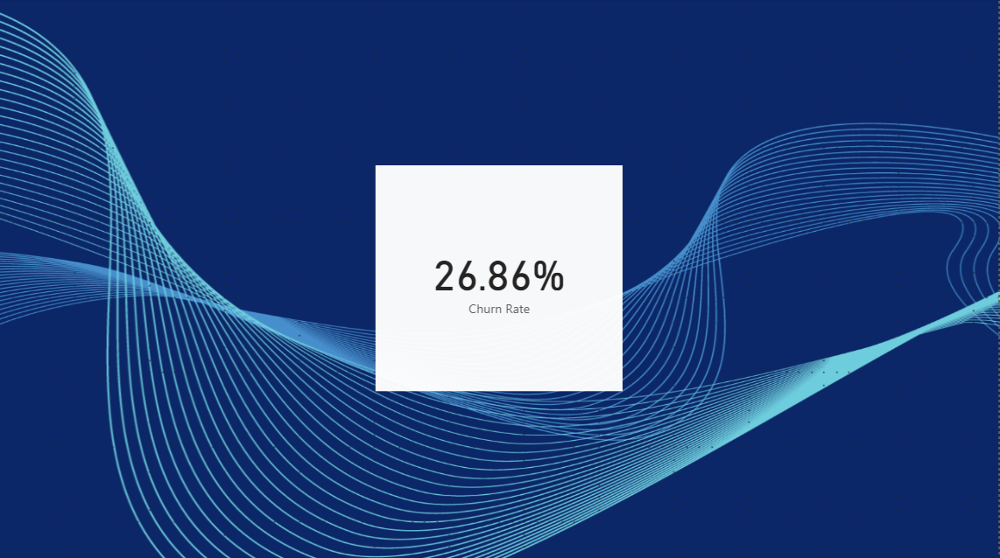

### 2. Reasons for Churn

**Visual:** Bar chart listing top churn reasons.
- Major reasons: Competitor offers, Competitor had better devices available, service dissatisfaction, price, network reliability.
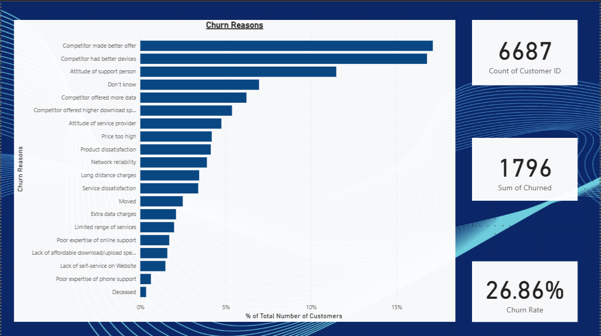

### 3. Churn Ratio by Category

**Visual:** Pie chart or bar chart breaking down churn by category.
- Largest category: 1:**Competitor** (805, 44.82%)
- Other categories: 2:Attitude, 3:Dissatisfaction, 4:Price, 5:Other
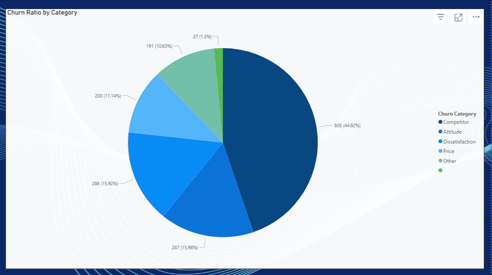

### 4. Churn by State

**Visual** Bubble map breaking down churn percentage within each state.
- Largest percentage churn by state: **California** (63.24%) 
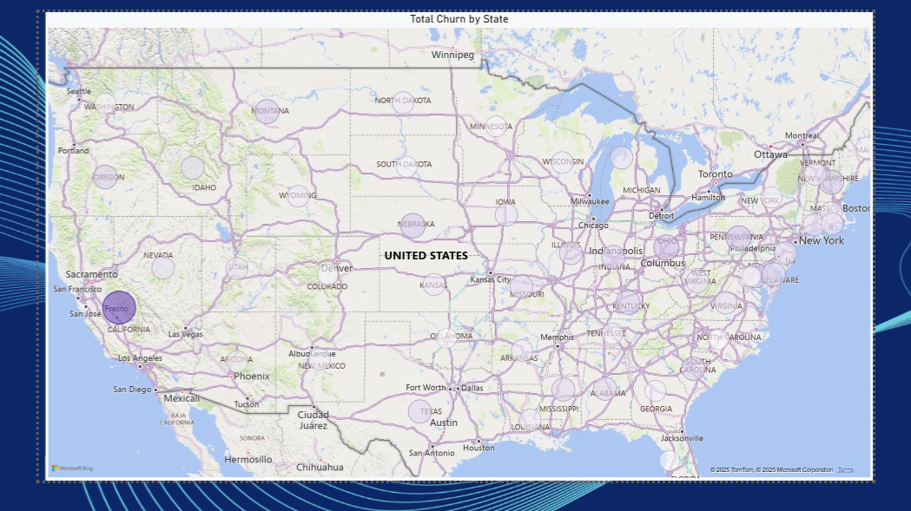

### 5. Churn by Age Demographic

**Visual:** Bar chart showing churn rates by age groups.
- **Senior:** 38.46% churn rate - Largest churn rate by age group (65+)
- **Under 30:** 22.95% churn rate
- **Other:** 24.60% churn rate
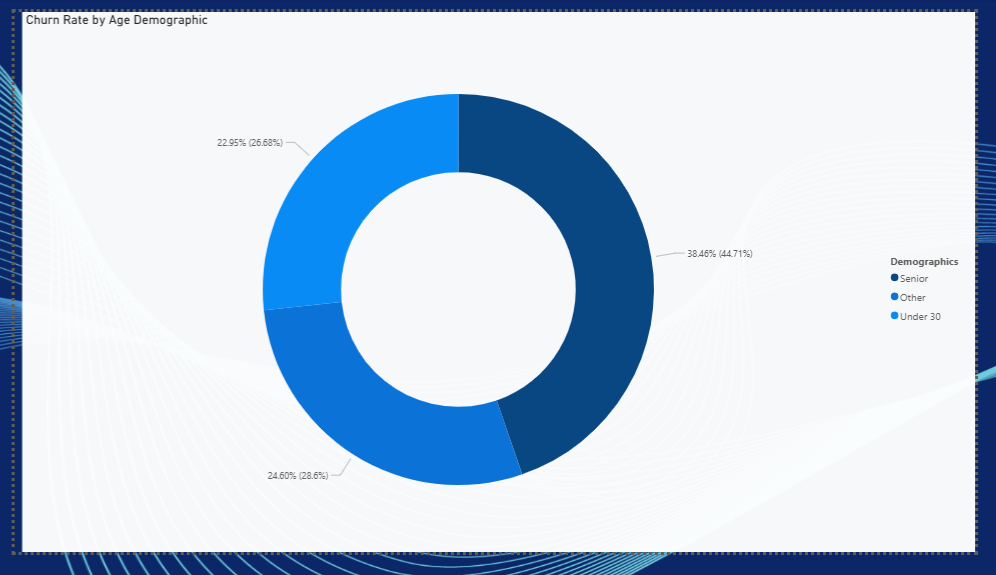

### 6. Churn Rate by Age Group

**Visual** Column chart with trend line displaying total customers and churn rate by age bins(5)
- **85+** highest churn rate(52%) of age groups
- **15-20** Lowest churn rate (14%) of age groups
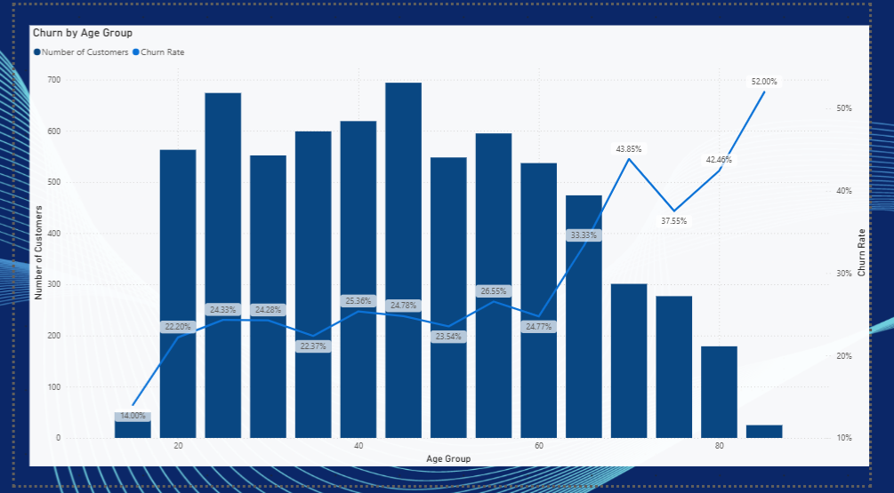

### 7. Churn Rate by Monthly Charge and Number of Customers in Group Contract

**Visual** Column chart with trend line displaying number of customers and customer churn rate.
- **1 customer in group** Highest monthly charge ($33.45 p/m), and highest churn rate (32.85%)
- **2 customer in group** Lowest monthly charge ($22.50 p/ m), churn rate (6.71%)
- **6 customer in group** Lowest churn rate (5.6%), monthly charge ($22.52 p/m)
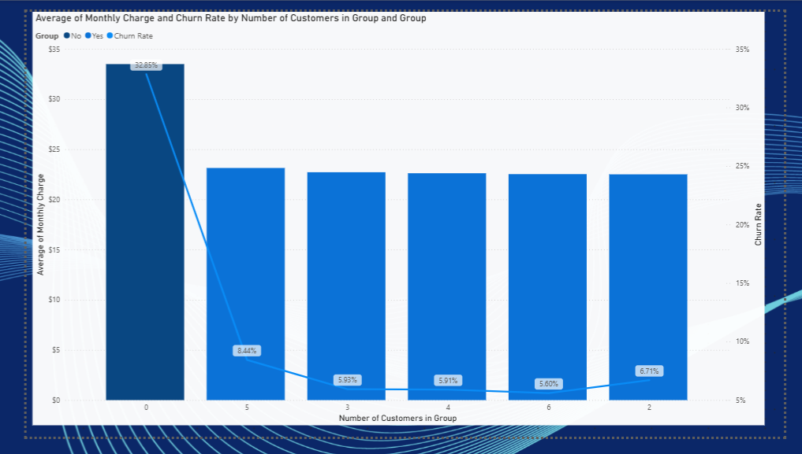

### 8. Churn Rate by Contract Type and Gender

**Visual:** Grouped bar chart by contract (Monthly, Yearly) and gender.
- **Monthly contract:** Highest churn (46.29%), by gender highest is female(47.31%)
- **Yearly contract:** Lowest churn (6.62%), by gender highest is male (7.21%)
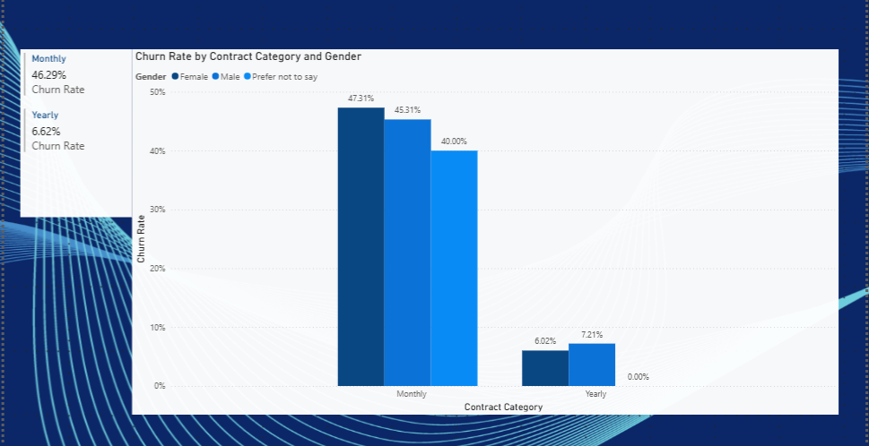

### 9. Unlimited Data Plan Impact

**Visual:** Bar chart showing churn rates by data plan type.
- **Unlimited data plan** customers using less than 5GB of data are most likely to churn(34.71%), those using more than 10GB are least likely (27.72%)
- **Limited data plan** Customers using between 5GB and 10GB are most likely to churn(31.78), whilst customers using less than 5GB of data are least likely to churn (12.31%)
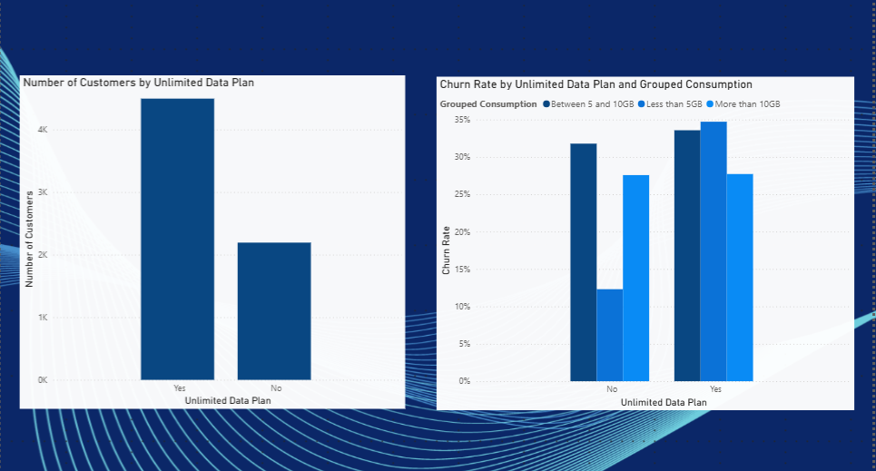

### 10. Geographic Distribution of Churn Based on International Calls

**Visual:** Interactive map with slicers displaying churn rate by state, comparing those with international call plans and those without, plus those who make active calls and those who do not
- State with the highest churn rate: **California** - Plan active/call active(66.67%), plan inactive/call active (72%), plan inactive/call inactive (52.29%), plan active/call inactive (100%)
- States with the lowest: **Washington DC** -plan active/call active (0%), plan inactive/call active (21.88%), plan inactive/call inactive (18.18%), plan active/call inactive (66.7%)
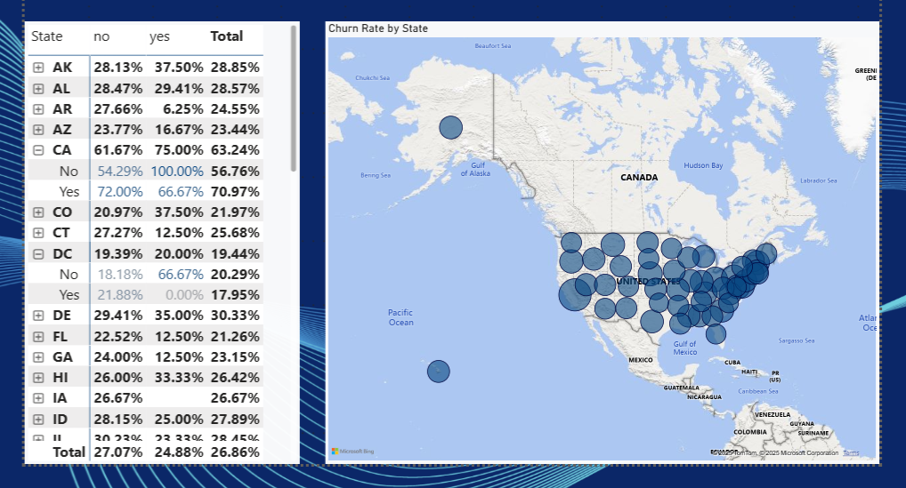

### 11. Account Length and Churn Visual, With  Contract Type and Payment Method Slicers

**Visual:** Line graph correlating account age with churn.
- Shorter account lengths generally show higher churn, overall churn rate decreases over time, though churn rates spike periodically at six month increments (potentially contract renewal dates?)
**Visual** line graph (as above) with trend lines based contract type: 'Month to Month', 'One Year', 'Two Year'
- **Month to Month** Highest churn rate over time, periodic spikes show largest churn percentages
- **One Year** Middle value churn rate over time, similiar periodic spikes though at far lower percentages than month to month.
- **Two Year** Lowest churn rate overall, few customers churn outside of periodic spikes. periodic spikes far lower than other contract types.
- **Payment Types** used to analyse churn rates over time, based on contract type, using payment method variable: 'Direct Debit' (55.36 of customers), 'Credit Card' (39.1% of customers), 'Paper Check' (5.6% of customers)
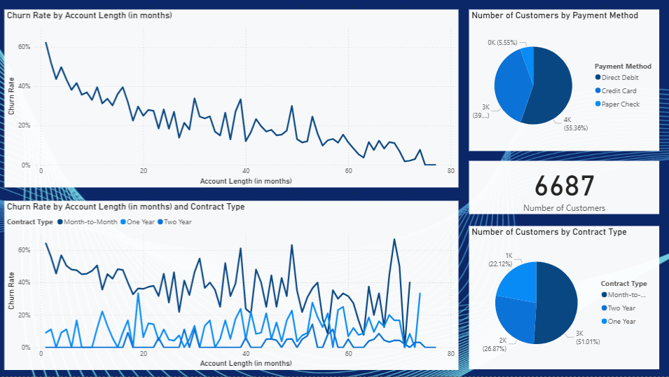

**Too much data to show all interactions, use the interactive visual via link at top of page to explore**

## Usage

- Download the report and accompanying visualizations for deeper analysis.
- Reference the breakdowns above to interpret each chart and graph.
- This file contains all exploratory data analysis listed above
- Finalised report contains the dashboards : Overview, Age Groups, Payment & Contract, Extra Charges, Insights.

## FINAL REPORT

## Overview 
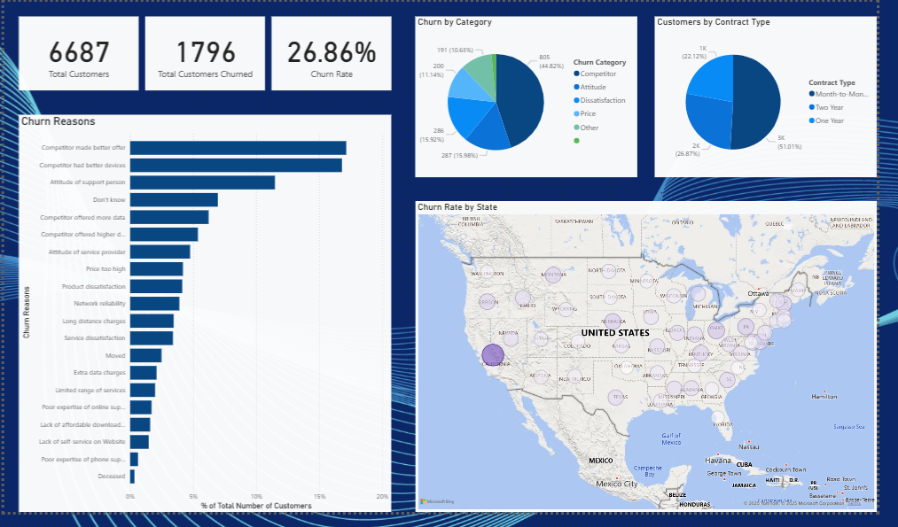

## Age Groups
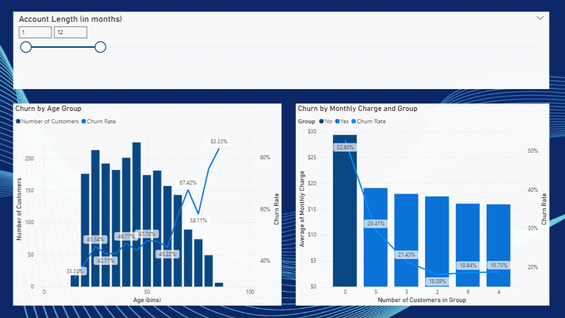

## Payment & Contract
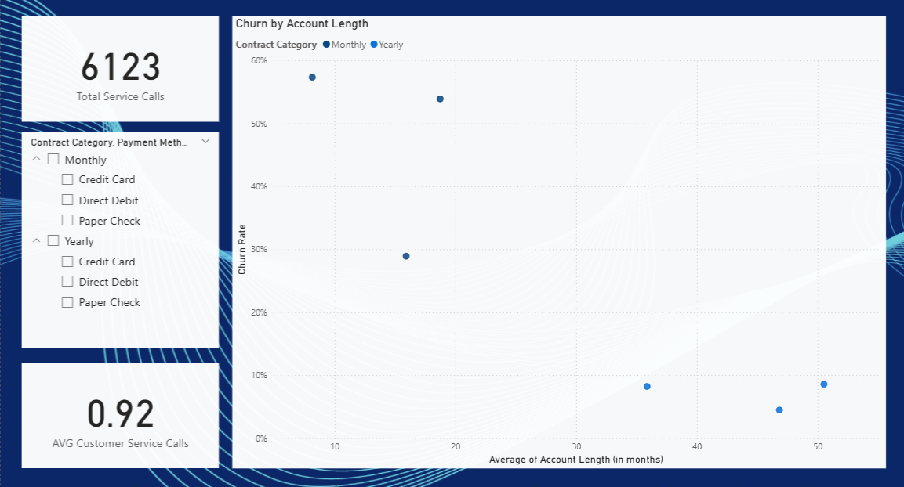

## Extra Charges
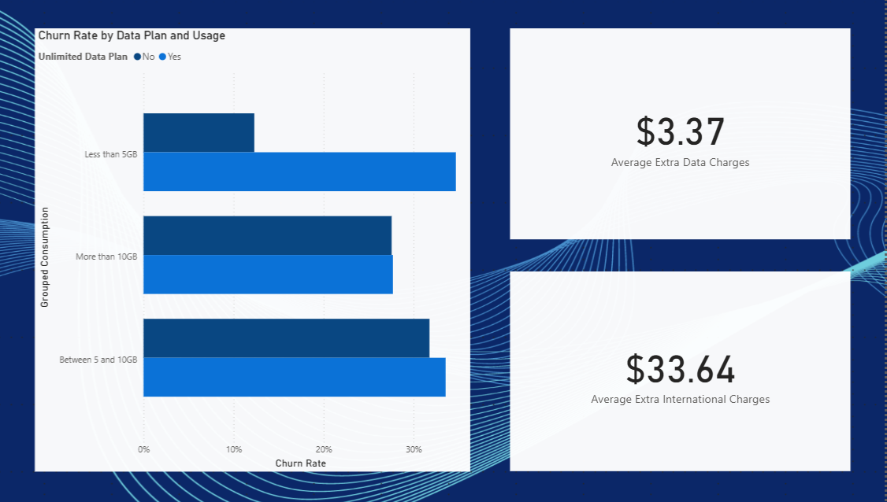

## Insights
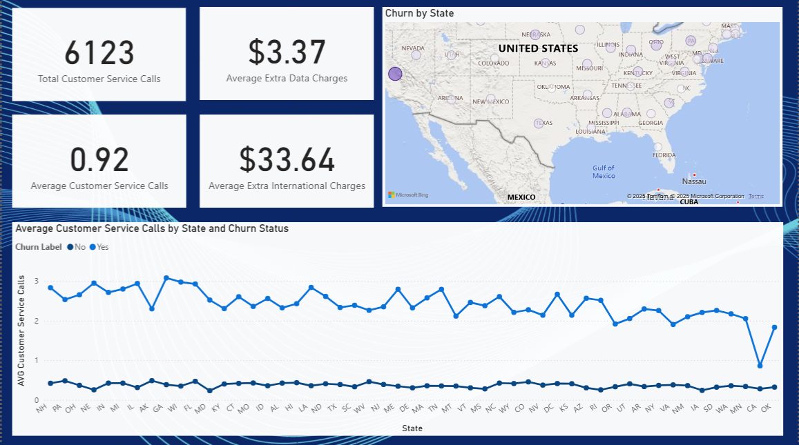

## License

Please cite the original report and respect data privacy for publication and analysis.

***

